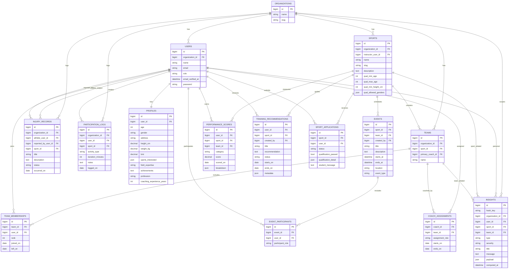

# Chapter 3 Diagrams (SAIMS / AthleteIMS)

This file contains **render-ready Mermaid diagrams** you can paste into Chapter 3 or render in Markdown and export as images.

---

## Figure: Coach/Staff Flowchart

```mermaid
flowchart TD
  A([Start]) --> B[Open SAIMS in browser]
  B --> C[Log in (email + password)]
  C --> D{Credentials valid?}
  D -- No --> E[Show error message]
  E --> C
  D -- Yes --> F[Coach/Staff Dashboard]

  F --> G{Select task}
  G --> H[View coached teams]
  H --> H2[View team roster]
  H2 --> F

  G --> I[Manage athletes]
  I --> I2[View athlete profiles & performance history]
  I2 --> F

  G --> J[Enter performance scores]
  J --> J2[Save score]
  J2 --> J3[System updates trends, insights, risk indicators]
  J3 --> F

  G --> K[Injury monitoring]
  K --> K2[View injury logs / Add injury record]
  K2 --> F

  G --> L[Analytics & predictions]
  L --> L2[View charts / Run win probability & strongest lineup tools]
  L2 --> F

  G --> M[AI recommendations hub]
  M --> M2[View AI-generated training plan summaries]
  M2 --> F

  F --> N[Log out]
  N --> O([End])
```

**Caption (paste under figure):** The Coach/Staff flow begins with authentication. After successful login, the coach/instructor accesses the dashboard and selects tasks such as managing athletes, entering performance scores, monitoring injuries, viewing analytics/predictions, and reviewing AI-generated recommendations, then logs out to end the session.

---

## Figure: Data Flow Diagram (DFD) – Context Diagram (Level 0)

```mermaid
flowchart LR
  %% External entities
  A[Admin]:::ext
  B[Coach/Instructor]:::ext
  C[Student-Athlete]:::ext
  D[AI Provider\n(Gemini/OpenAI/Grok)\nOptional]:::ext

  %% System (single process)
  P0((0.0 SAIMS\nStudent-Athlete Information\nManagement System)):::proc

  %% Data store (logical)
  DS[(Relational Database)]:::store

  %% Flows
  A -- account setup, sports setup,\nreports requests --> P0
  B -- scores, injury records,\nroster actions --> P0
  C -- sport applications,\nparticipation logs --> P0

  P0 -- dashboards, lists,\nreports, notifications --> A
  P0 -- dashboards, analytics,\nrosters, alerts --> B
  P0 -- dashboard, recommendations,\nstatus updates --> C

  P0 <--> DS

  P0 -- prompts (optional) --> D
  D -- structured JSON output --> P0

  classDef ext fill:#fff,stroke:#111,stroke-width:1px;
  classDef proc fill:#e8f0ff,stroke:#1f3a8a,stroke-width:1.5px;
  classDef store fill:#f4f4f5,stroke:#111,stroke-width:1px;
```

**Caption:** The Context DFD (Level 0) shows SAIMS as a single process interacting with three external entities (Admin, Coach/Instructor, and Student-Athlete). Inputs such as account management, sports setup, performance scores, injury records, sport applications, and participation logs are processed by SAIMS and stored in the database. The system returns dashboards, analytics, reports, and notifications. Optional AI providers may be called to generate narrative summaries and enriched training plans.

---

## Figure: Data Flow Diagram (DFD) – Level 1

> **Process numbering is thesis-friendly** (1.0, 2.0, 3.0, …) similar to your sample.

```mermaid
flowchart TB
  %% External Entities
  Admin[Admin]:::ext
  Staff[Coach/Instructor]:::ext
  Student[Student-Athlete]:::ext
  AI[AI Provider (optional)]:::ext

  %% Processes
  P1((1.0 User & Access\nManagement)):::proc
  P2((2.0 Sports & Roster\nManagement)):::proc
  P3((3.0 Applications &\nNotifications)):::proc
  P4((4.0 Performance &\nParticipation Logging)):::proc
  P5((5.0 Injury Monitoring\n& Risk Indicators)):::proc
  P6((6.0 Dashboards,\nAnalytics & Reports)):::proc
  P7((7.0 Recommendations\n& Insights)):::proc

  %% Data Stores
  D1[(D1 Users & Profiles)]:::store
  D2[(D2 Sports, Teams,\nMemberships)]:::store
  D3[(D3 Applications &\nNotifications)]:::store
  D4[(D4 Scores, Stats,\nParticipation Logs)]:::store
  D5[(D5 Injury Records)]:::store
  D6[(D6 Insights &\nTraining Recommendations)]:::store

  %% Flows: Admin
  Admin -- create/update users,\nissue access codes --> P1
  P1 -- user accounts,\nroles, auth status --> Admin
  P1 <--> D1

  Admin -- manage sports,\nassign students --> P2
  Staff -- roster actions,\nteam oversight --> P2
  P2 <--> D2

  %% Applications + notifications
  Student -- submit application,\nwithdraw/leave --> P3
  Staff -- approve/reject --> P3
  P3 -- status updates,\nalerts --> Student
  P3 -- alerts --> Staff
  P3 <--> D3
  P3 --> D2

  %% Logging
  Staff -- encode scores --> P4
  Student -- log participation --> P4
  P4 <--> D4

  %% Injury monitoring
  Staff -- injury record\ncreate/update --> P5
  P5 <--> D5
  P5 --> D1
  P5 --> D4

  %% Dashboards/analytics/reports
  Admin -- view dashboards,\nexport reports --> P6
  Staff -- view analytics,\npredictions --> P6
  Student -- view dashboard --> P6
  P6 --> Admin
  P6 --> Staff
  P6 --> Student
  P6 --> D4
  P6 --> D5
  P6 --> D6
  P6 --> D2

  %% Recommendations/insights (+ optional AI)
  P7 --> D6
  P7 --> Staff
  P7 --> Student
  P7 <-- facts/prompts (optional) --> AI
  P7 --> D4
  P7 --> D5
  P7 --> D1

  %% Typical triggers
  P4 --> P7
  P5 --> P7
  P6 --> P7

  classDef ext fill:#fff,stroke:#111,stroke-width:1px;
  classDef proc fill:#e8f0ff,stroke:#1f3a8a,stroke-width:1.5px;
  classDef store fill:#f4f4f5,stroke:#111,stroke-width:1px;
```

**Caption:** The Level 1 DFD decomposes SAIMS into major processes: user/access management, sports/roster management, applications/notifications, performance and participation logging, injury monitoring with risk indicators, dashboards/analytics/reports, and recommendations/insights. Each process reads from and writes to its corresponding data stores. The recommendations/insights process may optionally use an external AI provider to generate narrative summaries and enriched training plans.

---

## Figure: Entity Relationship Diagram (ERD)

> Notes:
> - The system is **multi-tenant**: most core records are scoped by `organization_id`.
> - Some pivot tables implement many-to-many membership (e.g., `sport_user`, `team_memberships`, `event_participants`).



**Caption:** The ERD shows the primary entities of SAIMS (users, profiles, sports, teams, applications, performance scores, injury records, participation logs, events, training recommendations, and insights) and their relationships. Organization scoping supports multi-tenant separation of data.

---

## Figure: Use Case Diagram

```mermaid
flowchart LR
  %% Actors
  Admin([Admin])
  Staff([Coach/Instructor])
  Student([Student-Athlete])
  System([SAIMS System])

  %% Grouping
  subgraph U["SAIMS Use Cases"]
    direction TB

    subgraph Auth["Access & Security"]
      direction TB
      UC_Login([Authenticate / Log in])
      UC_Logout([Log out])
      UC_Notify([View notifications])
    end

    subgraph AdminOps["Administration"]
      direction TB
      UC_UserMgmt([Manage user accounts (create/edit/delete roles)])
      UC_StudentMgmt([Manage student accounts (create/update/delete + access code)])
      UC_Reports([Export reports (e.g., performance CSV)])
      UC_SystemCfg([View system configuration])
    end

    subgraph SportsOps["Sports, Teams, and Rosters"]
      direction TB
      UC_SportsCRUD([Manage sports (CRUD)])
      UC_AssignStudents([Assign/remove students to sports])
      UC_Applications([Review sport applications (approve/reject)])
      UC_Rosters([View coached teams & rosters])
    end

    subgraph Monitoring["Monitoring & Logging"]
      direction TB
      UC_Scores([Record performance scores])
      UC_Injuries([Monitor injuries (view logs / create injury record)])
      UC_Participation([Log participation activities])
    end

    subgraph Analytics["Dashboards, Analytics, and Decision Support"]
      direction TB
      UC_Dashboards([View dashboards & KPIs])
      UC_Analytics([View analytics & charts])
      UC_Predictions([Run predictions (win probability / strongest lineup)])
      UC_Training([View training recommendations])
    end

    subgraph Background["System/Background Processing"]
      direction TB
      UC_Insights([Generate insights (trends-based)])
      UC_AI([Generate AI narrative summaries & AI-enriched training plans)])
    end
  end

  %% Actor links
  Admin --- UC_Login
  Staff --- UC_Login
  Student --- UC_Login
  Admin --- UC_Logout
  Staff --- UC_Logout
  Student --- UC_Logout

  Admin --- UC_Notify
  Staff --- UC_Notify
  Student --- UC_Notify

  Admin --- UC_UserMgmt
  Admin --- UC_StudentMgmt
  Admin --- UC_Reports
  Admin --- UC_SystemCfg

  Admin --- UC_SportsCRUD
  Admin --- UC_AssignStudents
  Admin --- UC_Applications

  Staff --- UC_SportsCRUD
  Staff --- UC_AssignStudents
  Staff --- UC_Applications
  Staff --- UC_Rosters

  Staff --- UC_Scores
  Staff --- UC_Injuries

  Student --- UC_Participation
  Student --- UC_Training
  Student --- UC_Dashboards
  Student --- UC_Analytics

  Admin --- UC_Dashboards
  Admin --- UC_Analytics
  Admin --- UC_Predictions
  Admin --- UC_Injuries

  Staff --- UC_Dashboards
  Staff --- UC_Analytics
  Staff --- UC_Predictions

  %% System-driven
  System --- UC_Insights
  System --- UC_AI

  %% Typical triggers (visual hint)
  UC_Scores --> UC_Insights
  UC_Scores --> UC_AI
  UC_Dashboards --> UC_Insights
```

**Caption:** The use case diagram identifies the three primary actors (Admin, Coach/Instructor, Student-Athlete) and the main functions they perform in SAIMS. It also shows system-driven background processes (insight generation and optional AI enrichment) that are triggered by normal workflows such as recording performance scores and viewing dashboards.

**Short write-up (paste in Chapter 3):** The Use Case Diagram describes the functional scope of SAIMS from the perspective of its users. Administrators manage accounts, students, sports, and reporting. Coaches/Instructors manage rosters, encode performance scores, and maintain injury monitoring records while using analytics tools to support decisions. Student-Athletes access dashboards, submit participation logs, browse/apply for sports, and view training recommendations. In addition, SAIMS performs background computations (e.g., trend-based insights and optional AI-generated summaries) to support dashboards and recommendations.

